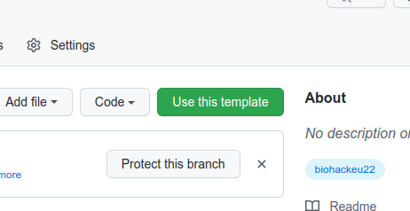
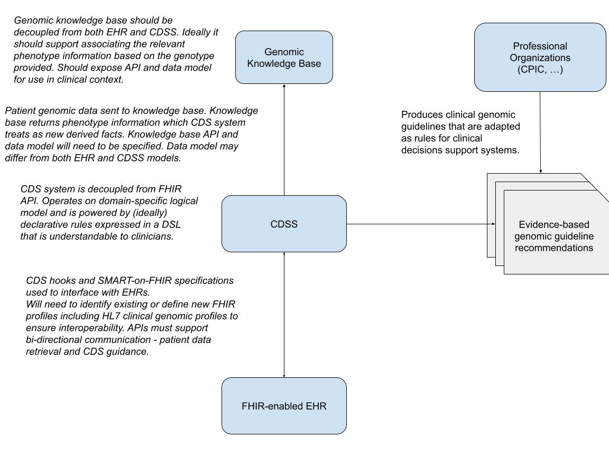

# BioHackrXiv Publication Template

Minimal example of a [BioHackrXiv](https://biohackrxiv.org/) publication that can be generated with the
[Preview Service](http://preview.biohackrxiv.org/).

## Step 1: Clone this Template Repository

This repository is a template repository. This means that you can hit the green "Use this template"
button (after logging in) to use it as a template to start a new BioHackrXiv Publication:



## Step 2: Configuring the Markdown

The publication Markdown is found in the `paper/paper.md` file. At the top you can edit the
YAML code with metadata. It is important to get this part correct, because otherwise the PDF
generation will fail. The metadata looks like this:

```yaml
title: 'A Platform for Personalized Medicine - A Survey of the Landscape'
title_short: 'Platform for Personalized Medicine'
tags:
  - Clinical Decision Support
  - Personalized Medicine
  - Pharmacogenomics
  - Precision Medicine
  - Genomics
  - BioHackathon
  - BioHackrXiv
authors:
  - name: Claude Nanjo
    orcid: 0000-0000-0000-0000
    affiliation: 1
  - name: Eric Prud'Hommeaux
    orcid: 0000-0000-0000-0000
    affiliation: 2
  - name: Soichi Ogishima
    orcid: 0000-0000-0000-0000
    affiliation: 2
  - name: Orion Buske
    orcid: 0000-0000-0000-0000
    affiliation: 2
  - name: Apiwat Sangphukieo (Nong)
    affiliation: 2
  - name: Nattawet Sriwichai (Golf)
    affiliation: 2
  - name: Chang Sun
    affiliation: 2
  - name: Chatarin (Chad) Wangsanuwat
    affiliation: 2
  - name: Andra Waagmeester
    affiliation: 2
  - name: David Steinberg
    affiliation: 2
  - name: Alex Kanitz
    affiliation: 2
  - name: Michel Dumontier
    affiliation: 2
affiliations:
  - name: University of Utah
    ror: 03r0ha626
    index: 1
  - name: Maastricht University
    ror: 02jz4aj89
    index: 2
date: 18 September 2025
cito-bibliography: paper.bib
event: BH25JP
biohackathon_name: "DBCLS BioHackathon 2025"
biohackathon_url:   "https://2025.biohackathon.org/"
biohackathon_location: "Mie, Japan, 2025"
group: Biomedical
# URL to project git repo --- should contain the actual paper.md:
    ror: 044rwnt51
    index: 2
date: 18 September 2025
cito-bibliography: paper.bib
event: BH25JP
biohackathon_name: "DBCLS BioHackathon 2025"
biohackathon_url:   "https://2025.biohackathon.org/"
biohackathon_location: "Mie, Japan, 2025"
group: Biomedical
# URL to project git repo --- should contain the actual paper.md:
git_url: https://github.com/biohackathon-japan/BH25-clinical-decision-support-platform-for-personalised-medicine
# This is the short authors description that is used at the
# bottom of the generated paper (typically the first two authors):
authors_short: Nanjo \emph{et al.}
```


## Step 3: Writing the article

A full Markdown example is given in [paper/paper.md](paper/paper.md). This includes instructions how to include
figures, tables, and annotate citations with the Citation Typing Ontology.

## Step 4: Previewing the paper as PDF

This repository can be converted into a preview PDF with BioHackrXiv [Preview Server](http://preview.biohackrxiv.org/).
The preview website asks for the link to your repository and will automatically find the `paper.md` and create an PDF.

---

# Platform for Personalized Medicine

## Introduction

The use of genomic knowledge in daily clinical practice still remains limited. Moreover, as this knowledge expands non-linearly, most clinicians are not adequately equipped to integrate it into their clinical practice. When genomic information is used in clinical care, the responsibility often falls solely on individual clinicians except for a few well-known use cases currently implemented in Electronic Health Record (EHR) systems. We argue that, without dedicated platforms and APIs to support the integration of genomic knowledge into clinical workflows, the promise of personalized medicine is unlikely to be realized.

While a number of efforts towards this goal have been documented in the literature, including an effort to demonstrate a CPIC-based PGx CDS service, none have made it into widespread production use. There are a number of reasons for this:

* Genomic information is not always consistently expressed between CPIC and laboratories producing genetic reports thus complicating rule triggering.
* Standards in this areas are still evolving making API specifications more difficult to define.
* Terminologies often do not express genomic data at the correct granularity.
* Implementations have been fairly limited to providing textual alerts upon prescribing a relevant medication rather than actionable guidance through the EHR (e.g., supporting placing an order for a medication with modified dosage).

We propose the development of an open-source clinical decision support APIs and reference implementation to enable personalized medicine, with an initial focus on pharmacogenomics.

Specifically, this includes:

* The modeling of genotype and phenotype information
* An API to retrieve phenotype information by querying relevant knowledge bases using a patient's genotype data.
* An API to access evidence-based clinical recommendations based on a patient’s genotype and/or phenotype.
* A framework for integrating this knowledge into EHR-based clinical decision support systems, enabling the seamless application of personalized genomic insights within routine clinical workflows.


---

## Use cases

### Pharmacogenomic Use Case: Thiopurine Dosing

#### 1. Clinical Context

Thiopurines are immunosuppressive and anticancer drugs including:

* Azathioprine
* 6-mercaptopurine (6-MP)
* Thioguanine (TG)

They are commonly used for acute lymphoblastic leukemia (ALL), inflammatory bowel disease (IBD), autoimmune diseases, and organ transplantation.
Response and toxicity vary widely due to genetic differences in drug metabolism.

#### 2. Key Genes and Variants

The CPIC guidelines focus on two pharmacogenes:

* **TPMT (thiopurine S-methyltransferase)**

  * Enzyme responsible for inactivation of thiopurines.
  * Variants (\*2, \*3A, \*3C) reduce or eliminate enzyme activity.
  * Inheritance: autosomal codominant.

* **NUDT15 (nudix hydrolase 15)**

  * Enzyme that hydrolyzes active thiopurine metabolites.
  * Key variant: \*2, \*3 (common in East Asian, Hispanic populations).
  * Deficiency → severe myelosuppression.

Both genes influence the balance between therapeutic effect and hematopoietic toxicity.

#### 3. Phenotype Categories (per CPIC)

CPIC assigns phenotypes based on diplotypes:

* **Normal metabolizer (NM)** – Normal TPMT or NUDT15 function.
* **Intermediate metabolizer (IM)** – One no-function allele.
* **Poor metabolizer (PM)** – Two no-function alleles.
* **Indeterminate** – Rare or uncertain variants.

#### 4. Dosing Recommendations (Simplified)

CPIC provides tables (drug-gene specific) with initial dose adjustments:

* **TPMT or NUDT15 Normal Metabolizer (NM/NM)**
  → Start standard dose.

* **Heterozygous / Intermediate metabolizer (IM)**
  → Reduce starting dose (30–80% of standard), adjust with therapeutic drug monitoring (TDM).
  → Increased risk of moderate myelosuppression.

* **Poor metabolizer (PM)**
  → Greatly reduce dose (≤10% of standard, or administer less frequently)
  → Some CPIC guidance: consider alternative non-thiopurine therapy.
  → Extremely high risk of life-threatening myelosuppression.

Important: Recommendations depend on whether TPMT or NUDT15 are abnormal. If both are reduced, dose must be drastically reduced or avoided altogether.

#### 5. Clinical Implementation

* Genotyping recommended before thiopurine therapy in oncology and IBD.
* Thiopurine metabolite monitoring (6-TGN, MeMP) helps optimize dose.
* Ethnic considerations:
  * TPMT variants more common in Europeans/Africans.
  * NUDT15 variants more common in East Asians and Latinos.

#### 6. Use Case Summary

Thiopurine pharmacogenomics is a prototypical case for precision medicine.
* A patient’s TPMT and NUDT15 genotype is used to predict risk of myelotoxicity.
* Dosing is personalized to balance efficacy and safety.
* Prevents life-threatening neutropenia and bone marrow suppression, reduces hospitalizations, and improves long-term therapy adherence.

---

## Risk Reduction: Familial Hypercholesterolemia

Here’s a clear clinical use case showing how genomics helps in Familial Hypercholesterolemia (FH):

### Condition overview

* FH is a common inherited disorder (1 in \~250 people) caused by pathogenic variants in **LDLR, APOB, or PCSK9**.
* Leads to very high LDL cholesterol from birth resulting in premature atherosclerotic cardiovascular disease (ASCVD).

### Use case: Genomic screening in a 35-year-old patient

**Clinical presentation:**

* A 35-year-old with LDL-C = 220 mg/dL, family history of early heart attack in father (age 42).
* Physical exam may show xanthomas, but not always.

**Genomic test:**

* FH panel sequencing identifies a pathogenic LDLR variant.
* Diagnosis of heterozygous FH is confirmed, even if criteria like Simon-Broome or Dutch Lipid Score were borderline.

**Impact on treatment:**

* **Intensified therapy:** Guidelines recommend high-intensity statins immediately, often with add-on ezetimibe or PCSK9 inhibitor if LDL not <100 mg/dL (or <70 if other risk factors).
* **Earlier initiation:** Treatment starts in 30s instead of waiting for clinical ASCVD or trying “lifestyle first.”
* **Aggressive targets:** Clinician justifies stricter LDL goals and use of newer drugs (PCSK9 inhibitors, inclisiran).

**Cascade screening:**

* First-degree relatives are offered targeted testing for the LDLR variant.
* Siblings/children who carry the variant can begin lipid-lowering therapy early (even in adolescence), preventing decades of LDL exposure.

**Prevention outcome:**

* Without diagnosis: patient might present with myocardial infarction at age 42 like father.
* With genomic confirmation: early treatment reduces LDL by 50–70%, dramatically lowering lifetime ASCVD risk.

### Why genomic screening helps

* **Diagnostic certainty:** separates true FH from “polygenic hypercholesterolemia.”
  [https://ashpublications.org/blood/article/140/21/2193/486384/Genomic-profiling-for-clinical-decision-making-in](https://ashpublications.org/blood/article/140/21/2193/486384/Genomic-profiling-for-clinical-decision-making-in)
* **Tailored therapy:** justifies use of high-cost agents (PCSK9 inhibitors) when LDL targets aren’t met.
* **Family benefit:** cascade testing finds asymptomatic carriers decades before their first event.
* **Public health impact:** population FH screening programs (e.g., in the Netherlands, UK) have shown significant mortality reduction by treating carriers early.

**In short:** Genomic screening for FH turns a patient with “high cholesterol” into a clearly identified, high-risk genetic case, leading to earlier, more aggressive treatment and preventive care for relatives.

---

## Risk Reduction: Hereditary Breast/Ovarian Cancer (BRCA1/2) — Thailand

### Overview

Pathogenic variants in **BRCA1/BRCA2** markedly raise lifetime risks of breast and ovarian cancer; Thai NCI materials outline higher-than-population risks and recommend earlier, more intensive surveillance and consideration of risk-reducing surgery for carriers.

### Example case

**Genomic testing in a 38-year-old with triple-negative breast cancer (TNBC)**

* **Clinical History:** A 38-year-old Thai woman with newly diagnosed TNBC and an aunt with ovarian cancer.
* There is a clear criteria for when the government would pay for the testing. Examples include: Diagnosed with TNBC, male breast cancer, breast cancer diagnosed before 45, breast cancer diagnosed + family history (clear guideline on what kind of family history - one set for 46-50 and the other for 50+). + Direct relative of high-risk breast cancer patients

**Typical test**

* NGS for BRCA1/BRCA2 (could be specific genes or as a cancer-panel).
* Reports will follow ACMG classification of variant pathogenicity terminology: Pathogenic, Likely Pathogenic, Variant of Uncertain Significance (VUS), Likely Benign, and Benign.
* The variants that are Likely Benign and Benign are not reported.
* There should also be gene/variant details (HGVS), zygosity, methods (+how many genes tested), limitations, and interpretations/recommendations.

**Patient management post-test**

* If positive (Pathogenic/Likely Pathogenic), could get surgery, therapy, more surveillance, and cascade testing.
* If negative, could consider other genes/possibilities.

---

## Prevention Use Case: BRCA1/2 Result Return in the General Population

#### 1. Clinical Context

* **Population:** General population who participated in research on returning genomic results within the Tohoku Medical Megabank project in Japan.
* **Disease Risk:** Hereditary breast and ovarian cancer syndrome (HBOC). Pathogenic variants (PVs) in BRCA1/2 increase the risk of breast, ovarian, prostate, and pancreatic cancers.
* **Significance:** Unlike patients in hospitals, genomic risk information was returned to members of the general population. This represents an innovative model for applying precision medicine to preventive and public health.
* **Challenges:** Potential psychological burden of disclosing risk to healthy individuals, implications for family members, and limitations of health insurance coverage.

#### 2. Key Genes and Variants

* Pathogenic variants (PVs) in BRCA1 and BRCA2 were identified.
* All were classified as Pathogenic (P) in ClinVar and as disease-causing mutations (DM) in HGMD.
* Minor allele frequencies (MAFs) in Japanese-specific reference panels were extremely rare (0.0001–0.0003).

#### 3. Risk Categories

* **Pathogenic Variant Carrier (PV+)**
  Individuals at high genetic risk, even if healthy. Often with family history or previous cancer.
* **PV Negative (PV–)**
  No pathogenic BRCA1/2 variants detected, but environmental and lifestyle-related cancer risks remain.

#### 4. Recommendations (Simplified)

* **PV Carriers (in the general population):**

  * Recommended medical surveillance (e.g., breast cancer screening, MRI, PSA testing).
  * Risk-reducing surgeries (e.g., salpingo-oophorectomy, mastectomy) as options.
  * Genetic counseling and testing for family members.

* **PV Negative:**

  * Results returned by mail. Emphasis that absence of BRCA1/2 variants does not mean zero risk. Regular health checkups and lifestyle improvements are encouraged.

#### 5. Clinical Implementation (General Population Setting)

**Return process:**

* All participants had already undergone whole-genome sequencing (WGS) as part of the Tohoku Medical Megabank project.
* Participants were first asked if they wished to receive results, without revealing gene names or disease names.
* Those who consented underwent re-sampling and validation testing.
* Results were explained in person by medical geneticists and specialists, with recommendations for surveillance and preventive options.
* Referral to University Hospital for follow-up, with the option of family genetic testing.

**Platform:**

In the Prevention Use Case of returning BRCA1/2 results to the general population, the implementation was carried out with three main components:

* **Participant Health Record Management System:** Responsible for storing and managing participant-specific data, including genetic testing results, family and medical history. Provides structured participant data for downstream services. Corresponds to the EHR in a hospital setting.
* **Pathogenic Variant Pipeline (Bioinformatics Pipeline):** Built as a bioinformatics pipeline separately from the Participant Health Record Management System. Interprets structured patient data retrieved from the Participant Health Record Management System in light of genomic knowledge and produces context-specific clinical recommendations, such as enhanced surveillance, preventive surgeries, or referral to genetic counseling. Corresponds to the CDS in a hospital setting.
* **Genomic KB:** Decoupled from both Participant Health Record and CDS. For BRCA1/2, ClinVar and HGMD serve as the authoritative resources for variant classification, ensuring consistent interpretation of pathogenic variants.

* **Psychological Impact:** Average K6 scores did not show persistent negative effects; most participants responded positively and were motivated to act.
* **Family Impact:** Many participants shared results with relatives, and daughters or sisters often sought genetic testing themselves.
* **Systemic Limitations:** In Japan, preventive interventions for unaffected carriers and family members are not covered by insurance, creating financial burdens.

#### 6. Use Case Summary

* Demonstrates the return of BRCA1/2 genomic results to the general population, not only hospital patients.
* Participants accepted the information constructively and took preventive actions such as enhanced screening or considering surgery.
* Family involvement was substantial, extending the benefits beyond the individual.
* Serves as a public health model of precision medicine, expanding its role from treatment settings to prevention and population-level healthcare.

---

## Rare Disease Screening

Applications currently exist, such as **PubCaseFinder**, allowing clinicians to enter patient diagnoses and be presented with a list of potentially relevant rare diseases by order of relevance.

Such applications offer the potential of being integrated into CDS systems such that on opening the patient chart, the patient’s problem list and encounter diagnoses, along with any additional supporting data can be sent to such an API, and search results then be presented to the clinicians. Another possibility is to allow clinicians to trigger the functionality on demand.

---

## High-level Platform Requirements

* System shall support the incorporation of genomic knowledge in clinical practice
  * System shall have access to structured genomic data from the patient record (generally as lab results) and/or for a third party source
  * System shall have access to genomic knowledge (not patient-specific) such as genotype → phenotype mappings (may come from querying a genomic knowledge base directly or indirectly - e.g., via the performing lab)
  * Genomic data structure and semantics shall be standardized and be represented with sufficient granularity
    * **Proper separation of semantics**
      * Example: The SNOMED-CT code `|http://snomed.info/sct|1144910008|Cytochrome P450 family 2 subfamily C member 9 *3/*3 poor metabolizer (finding)|` pre-coordinates both genotypic and phenotypic information in a single concept. Ideally: gene (CYP269), genotype (\*3/\*3), and phenotype (`|http://snomed.info/sct|3371000181103 | Poor metabolizer (qualifier value)|`) should be separate concepts/expressions so as not to get a combinatorial explosion of concepts in SNOMED.
    * **Standard data models for:**
      * Patient data originating from the EHR, including genetic lab results (via profiled FHIR resources such as Observation and MolecularDefinition)
      * Logical representation of patient data for use by CDS rule logic (may use FHIR if no logical model exists)
      * Genomic data passed to and received from genomic knowledge base (API currently undefined)

  * Genomic knowledge and resulting clinical guidance shall be presented in a form that is actionable by a CDS system. A CDS system may delegate to a separate CDS system for genome-specific clinical recommendation (for instance, a shared service exposed by a professional organization such as CPIC - though such a system does not currently exist). Ideally such genome-based clinical knowledge should be made available in a computable format (e.g., CQF-based knowledge artifacts) so as to eliminate the need for every CDS provider to implement this knowledge from non-computable guidelines.
  * The EHR, CDS, and Genomic KB components of the overall system should be decoupled from one another
    * The CDS system shall integrate into the EHR via two standards - CDS Hooks or SMART-on-FHIR. Native integration may be required for EHRs that are not FHIR-compliant.
    * The CDS system may operate on a data model that is distinct from FHIR. Such decoupling is recommended (1) to support non-FHIR systems (e.g., legacy systems) and (2) to support the independent expressivity and evolution of knowledge artifacts from the FHIR standard.
    * The Genomic KB shall be decoupled from both EHR and CDSS as it may be used in contexts unrelated to clinical practice. It is anticipated that data conveyed to and from such a system will require transformations to either FHIR or the CDS logical model.
    * The Genomic KB might be invoked by a separate entity from the CDSS such as the performing laboratory. In this case, an additional step may be needed to structure the results from the laboratory for use by the CDS system.

---

## Platform Specification

Given the breadth of use cases where genomics can be applied to medicine, we propose a flexible system that allows the pairing of system components to meet the realities in the field and APIs that support various degrees of formalism. For instance, one can expect that common pharmacogenomic use cases will generally support standard coding schemes (e.g., LOINC and SNOMED-CT) and be associated with corresponding clinical guidance whereas cutting edge work in genomic oncology may follow different conventions, workflows and approaches.

For instance, one may wish to support the following system configurations:
  * A lab report produces results that specify the genomic profile of an individual (e.g., CYP2C9 *1/*3). These results are then provided to a genomic knowledge base in order to find the associated phenotypes (e.g., Intermediate metabolizer → reduced clearance of warfarin) and the relevant phenotypes are then passed to another service that provides care guidance (e.g., A patient with CYP2C9 *1/*3 and VKORC1 A/A may need 2–3 mg/day instead of the standard 5 mg/day starting dose).
  * In most cases, a lab report will provide both genotype and associated phenotypes (e.g., CYP2C9 *1/*3 - Intermediate metabolizer → reduced clearance of warfarin) in either a structured or unstructured format. This information and the candidate drug can then be matched to the proper CPIC guideline for treatment recommendations.
  * In the field of cancer genomics, an identified variant is classified for oncogenicity and potentially matched with a set of actionable therapies or recommendations for further genetic testing.

In the first example, a CDS system routes genomic test results to a genomic knowledge base and subsequently routes the resulting genotype, phenotype and clinical context (e.g., drug being prescribed, patient information, etc…) to a separate service to obtain genome-specific clinical guidance.

In the second example above, the genomic knowledge base functionality is invoked by the laboratory directly rather than by the CDS system. The CDS system then routes the resulting genomic lab results along with clinical context to a potentially separate service in order to obtain genome-specific clinical guidance.

---

## Implementation Considerations for a PGx Service

* Normalization of genotype and phenotype inputs to PGx service. Patient genotype and phenotype information may be presented in a number of formats - free text vs structured and coded, variant-based vs star-notation-based. A number of steps may be required to structure and normalize the inputs.
* Specification of service input requirements in computable form. A service such as one to provide guidance on warfarin dosage may require inputs beyond the patient’s genotype/phenotype such as age, race, weight, etc… Such input requirements should be specifiable in a structured way. The CDS Hooks specification supports this requirement in the way of ‘prefetch’ statements.
* Ideally the output of such a service goes beyond a free-text alert. In this case, the guidance should also be represented in structured form and the service should specify the format of such output (e.g., in the form of a FHIR implementation guide)
* CPIC guidelines are currently specified in free text. They should also be defined in a structured and computable form. CQF CPG standards currently in development might be a step in this direction.
* CPIC guidelines often make use of dosing calculators. Such calculators will also need to be implemented as services unless such services already exist.

---

## Next-Steps

Our initial efforts focused on surveying the landscape to better understand the state of clinical genomics and its direct applications in medical practice. Given the breadth of the field, we opted to focus initially on pharmacogenomics and address in the future other important areas of clinical genomics. We concluded that though great advances have been made in this space, more remains to be done in the area of standards development and knowledge representation before a practical interoperable and shareable representation of such knowledge can be made available to consuming applications. Until we reach that point, the community may still benefit from PGx services that offer computable representation of such guidance based on a best-of-breed  ‘community-of-use’ specification. As standards mature, future iterations could then offer fully standard APIs.

---

